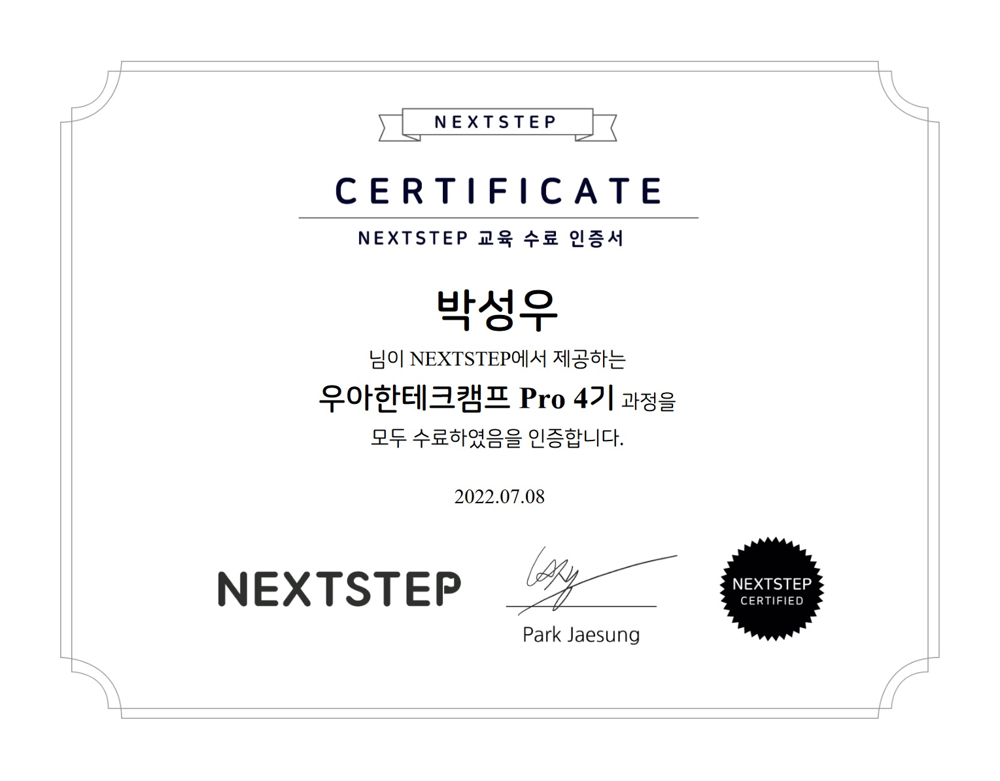

## 🏫 우아한테크캠프 프로4th 후기

👨‍💼 리더 : 넥스트스텝 박재성님

📃 내용 : 코드 리뷰를 통한 미션 수행과 어떤 개발자로 성장해 나갈 것인지를 제시하는 과정

📆 일정 : 2022년 5월 9일(화)부터 9주간 매주 목 19:30~22:30

​

## ❔ 지원동기

직무 전문성과 지속 가능성에 대한 고민

잦은 개발 인력 교체, 단기 성과 위주 개발 문화에서 만들어지는 시스템은 항상 불안정할 수밖에 없었습니다.
빠르게 움직여야 하는 스타트업임을 감안하더라도 CS 방에서 대기하며 실시간으로 그때그때 대응해야 하는 것은 너무나 힘든 일이었습니다.
시스템 개발과 운영, 데이터 관련 작업, CS 및 기타 직원 문의 응대와 같은 일을 병행하는 역할보다는 하나의 업무에 집중해서 문제를 해결하고 성공적인 결과를 만들어 내고 싶은 생각이 강해졌습니다.

그러기 위해서는 무엇보다도 실력을 갖추는 것이 올바른 방향이라고 생각했고 회사에서 경험하기 힘든 부분을 어디에서 충족할 수 있을지 찾게 되었습니다. 많은 교육 과정이 있었지만 우아한테크캠프 프로를 신청한 이유는 첫째로 백엔드 개발자에게 정말 필요한 내용으로 잘 구성되어 있다는 점입니다. 백엔드 범위가 방대하기 때문에 한정된 시간 내에 모든 것을 배울 수는 없지만 제 연차에 한 번 짚고 넘어가야 하는 내용들이기 때문에 만족도가 높을 것 같았습니다.
둘째로 생각할 수 있는 힘을 기르도록 미션과 피드백이 존재한다는 점입니다. 개발자의 역량에 따라 문제를 풀어내는 방법과 속도에 큰 차이가 있기 때문에 교육만 듣고 끝나는 수업은 생각하지 않았습니다.
셋째로 직장 동료분으로부터 넥스트스텝의 교육 후기를 듣고 확신이 들었습니다. 잠을 줄여가면서까지 정말 재미있게 교육을 즐겼다는 사람은 처음 봤었고 앞으로의 커리어에 대해 많이 고민하는 저에게 기회가 되면 적극적으로 도전해보라고 권유해주셨습니다.
우아한테크캠프 프로의 참여가 제 인생에 있어 진정한 개발자로 성장하는 전환점이 되었으면 좋겠습니다.

​

## 🏎️ 프리코스

✔️ 1주차 : 숫자 야구 게임 : 미션 설명, 내용 정리, 소스 코드

✔️ 2주차 : 자동차 경주 게임

​

## 💡 주차별 미션

✔️ 1주차 : 문자열 덧셈 계산기 : [미션 설명](docs/STEP1_CALCULATOR.md), 내용 정리, 소스 코드 

✔️ 1주차 : TDD 기반 로또 구현 : [미션 설명](docs/STEP1_LOTTO.md), 내용 정리, 소스 코드

✔️ 2주차 : JPA

✔️ 3주차 : 인수 테스트 주도 개발

✔️ 4주차 : 그럴듯한 서비스 만들기

✔️ 5주차 : 인수 테스트 기반 TDD

✔️ 6주차 : 서비스 진단하기

✔️ 7주차 : 레거시 코드 리팩토링

✔️ 8주차 : 안정적인 서비스 만들기

​

# 🎓 교육 수료증

