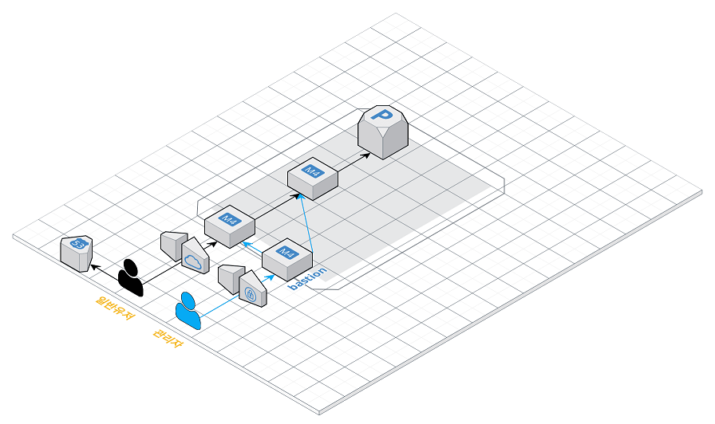

### 🎯 학습 목표



- AWS 상에서 네트워크를 구성하며, 네트워크 기본 개념들을 학습해봅니다.
- 컨테이너를 학습하고 3 tier로 운영환경을 구성해봅니다.
- 개발 환경을 구성해보고 지속적 통합을 경험해봅니다.

---

### 1. 서비스 구성하기

요구사항
- 웹 서비스를 운영할 네트워크 망 구성하기
- 웹 애플리케이션 배포하기

요구사항 설명
- [저장소](https://github.com/next-step/infra-subway-deploy) 를 활용하여 아래 요구사항을 해결합니다.
- README 에 있는 질문에 답을 추가한 후 PR을 보내고 리뷰요청을 합니다.

망 구성
- VPC 생성
    - CIDR은 C class(x.x.x.x/24)로 생성. 이 때, 다른 사람과 겹치지 않게 생성
- Subnet 생성
    - 외부망으로 사용할 Subnet : 64개씩 2개 (AZ를 다르게 구성)
    - 내부망으로 사용할 Subnet : 32개씩 1개
    - 관리용으로 사용할 Subnet : 32개씩 1개
- Internet Gateway 연결
- Route Table 생성
- Security Group 설정
    - 외부망
        - 전체 대역 : 8080 포트 오픈
        - 관리망 : 22번 포트 오픈
    - 내부망
        - 외부망 : 3306 포트 오픈
        - 관리망 : 22번 포트 오픈
    - 관리망
        - 자신의 공인 IP : 22번 포트 오픈
- 서버 생성
    - 외부망에 웹 서비스용도의 EC2 생성
    - 내부망에 데이터베이스용도의 EC2 생성
    - 관리망에 베스쳔 서버용도의 EC2 생성
    - 베스쳔 서버에 Session Timeout 600s 설정
    - 베스쳔 서버에 Command 감사로그 설정

*주의사항
- 다른 사람이 생성한 리소스는 손대지 말아요 🙏🏻
- 모든 리소스는 태그를 작성합니다. 이 때 자신의 계정을 Prefix로 붙입니다. (예: brainbackdoor-public)

웹 애플리케이션 배포
- 외부망에 [웹 애플리케이션](https://github.com/next-step/infra-subway-deploy) 을 배포
- DNS 설정

---

### 2. 서비스 배포하기

요구사항
- 운영 환경 구성하기
- 개발 환경 구성하기

요구사항 설명

운영 환경 구성하기
- 웹 애플리케이션 앞에 Reverse Proxy 구성하기
    - 외부망에 Nginx로 Reverse Proxy를 구성
    - Reverse Proxy에 TLS 설정
- 운영 데이터베이스 구성하기

개발 환경 구성하기
- 설정 파일 나누기
    - JUnit : h2, Local : docker(mysql), Prod : 운영 DB를 사용하도록 설정

---

### 도커 설치

```
$ sudo apt-get update && \
sudo apt-get install -y apt-transport-https ca-certificates curl software-properties-common && \
curl -fsSL https://download.docker.com/linux/ubuntu/gpg | sudo apt-key add - && \
sudo apt-key fingerprint 0EBFCD88 && \
sudo add-apt-repository "deb [arch=amd64] https://download.docker.com/linux/ubuntu $(lsb_release -cs) stable" && \
sudo apt-get update && \
sudo apt-get install -y docker-ce && \
sudo usermod -aG docker ubuntu && \
sudo curl -L "https://github.com/docker/compose/releases/download/1.23.2/docker-compose-$(uname -s)-$(uname -m)" -o /usr/local/bin/docker-compose && \
sudo chmod +x /usr/local/bin/docker-compose && \
sudo ln -s /usr/local/bin/docker-compose /usr/bin/docker-compose
```

### Reverse Proxy

Dockerfile
```
FROM nginx

COPY nginx.conf /etc/nginx/nginx.conf  
```

nginx.conf
```
events {}

http {
  upstream app {
    server 172.17.0.1:8080;
  }

  server {
    listen 80;

    location / {
      proxy_pass http://app;
    }
  }
}
```

실행
```
$ docker build -t nextstep/reverse-proxy:0.0.1 .
$ docker run -d -p 80:80 --name proxy nextstep/reverse-proxy:0.0.1
```

---

### TLS

서버의 보안과 별개로 서버와 클라이언트간 통신상의 암호화가 필요합니다. 평문으로 통신할 경우, 패킷을 스니핑할 수 있기 때문입니다.

📌 letsencrypt를 활용하여 무료로 TLS 인증서를 사용할 수 있어요.

```
$ docker run -it --rm --name certbot \
  -v '/etc/letsencrypt:/etc/letsencrypt' \
  -v '/var/lib/letsencrypt:/var/lib/letsencrypt' \
  certbot/certbot certonly -d '*.도메인' -d '도메인' --manual --preferred-challenges dns --server https://acme-v02.api.letsencrypt.org/directory
```

📌 인증서 생성 후 유효한 URL인지 확인을 위해 DNS TXT 레코드로 추가합니다.
```
Please deploy a DNS TXT record under the name
_acme-challenge.도메인 with the following value:

레코드

Before continuing, verify the record is deployed.
```

DNS를 설정하는 사이트에서 DNS TXT 레코드를 추가한 후, 제대로 반영되었는지 dig 명령어로 확인한 후에 인증서 설정 진행을 계속합니다.
```
 dig -t txt _acme-challenge.도메인 +short
```

📌 생성한 인증서를 활용하여 Reverse Proxy에 TLS 설정을 해봅시다. 우선 인증서를 현재 경로로 옮깁니다.
```
$ sudo cp /etc/letsencrypt/live/[도메인]/fullchain.pem ./
$ sudo cp /etc/letsencrypt/live/[도메인]/privkey.pem ./
```

📌 Dockerfile 을 아래와 같이 수정합니다.
```
FROM nginx

COPY nginx.conf /etc/nginx/nginx.conf 
COPY certs/fullchain.pem /etc/letsencrypt/live/[도메인]/fullchain.pem
COPY certs/privkey.pem /etc/letsencrypt/live/[도메인]/privkey.pem
```

📌 nginx.conf 파일을 아래와 같이 수정합니다.
```
events {}

http {       
  upstream app {
    server 172.17.0.1:8080;
  }
  
  # Redirect all traffic to HTTPS
  server {
    listen 80;
    return 301 https://$host$request_uri;
  }

  server {
    listen 443 ssl;  
    ssl_certificate /etc/letsencrypt/live/[도메인]/fullchain.pem;
    ssl_certificate_key /etc/letsencrypt/live/[도메인]/privkey.pem;

    # Disable SSL
    ssl_protocols TLSv1 TLSv1.1 TLSv1.2;

    # 통신과정에서 사용할 암호화 알고리즘
    ssl_prefer_server_ciphers on;
    ssl_ciphers ECDH+AESGCM:ECDH+AES256:ECDH+AES128:DH+3DES:!ADH:!AECDH:!MD5;

    # Enable HSTS
    # client의 browser에게 http로 어떠한 것도 load 하지 말라고 규제합니다.
    # 이를 통해 http에서 https로 redirect 되는 request를 minimize 할 수 있습니다.
    add_header Strict-Transport-Security "max-age=31536000" always;

    # SSL sessions
    ssl_session_cache shared:SSL:10m;
    ssl_session_timeout 10m;      

    location / {
      proxy_pass http://app;    
    }
  }
}
```

📌 방금전에 띄웠던 도커 컨테이너를 중지 & 삭제하고 새로운 설정을 반영하여 다시 띄워봅시다.
```
$ docker stop proxy && docker rm proxy
$ docker build -t nextstep/reverse-proxy:0.0.2 .
$ docker run -d -p 80:80 -p 443:443 --name proxy nextstep/reverse-proxy:0.0.2
```

---

### 설정 파일 나누기

```
spring.datasource.driver-class-name=com.mysql.cj.jdbc.Driver
spring.datasource.url=jdbc:mysql://192.168.171.168:3306/subway?serverTimezone=Asia/Seoul&useSSL=false
spring.datasource.username=root
spring.datasource.password=masterpw
spring.jpa.hibernate.ddl-auto=none
```
application-prod.properties

```
nohup java -jar [jar파일명] --spring.profiles.active=prod 1> subway.log 2>&1 &
```
--spring.profiles.active 옵션을 추가하여 실행하면 application-prod.properties의 설정을 사용합니다.

---

### 3. 배포 스크립트 작성하기

요구사항
- 배포 스크립트 작성하기
    - 반복적으로 실행하더라도 정상적으로 배포하는 스크립트를 작성해봅니다.


* 반복적으로 사용하는 명령어를 Script로 작성해봅니다.
```
#!/bin/bash

## 변수 설정

txtrst='\033[1;37m' # White
txtred='\033[1;31m' # Red
txtylw='\033[1;33m' # Yellow
txtpur='\033[1;35m' # Purple
txtgrn='\033[1;32m' # Green
txtgra='\033[1;30m' # Gray


echo -e "${txtylw}=======================================${txtrst}"
echo -e "${txtgrn}  << 스크립트 🧐 >>${txtrst}"
echo -e "${txtylw}=======================================${txtrst}"

## 저장소 pull
## gradle build
## 프로세스 pid를 찾는 명령어
## 프로세스를 종료하는 명령어
## ...
```

* 기능 단위로 함수로 만들어봅니다.
```
function pull() {
  echo -e ""
  echo -e ">> Pull Request 🏃♂️ "
  git pull origin master
}

pull;
```

* 스크립트 실행시 파라미터를 전달해봅니다.
```
#!/bin/bash

## ...

EXECUTION_PATH=$(pwd)
SHELL_SCRIPT_PATH=$(dirname $0)
BRANCH=$1
PROFILE=$2

## 조건 설정
if [[ $# -ne 2 ]]
then
    echo -e "${txtylw}=======================================${txtrst}"
    echo -e "${txtgrn}  << 스크립트 🧐 >>${txtrst}"
    echo -e ""
    echo -e "${txtgrn} $0 브랜치이름 ${txtred}{ prod | dev }"
    echo -e "${txtylw}=======================================${txtrst}"
    exit
fi

## ...
```
- 실행시 파라미터를 전달하도록 하여 범용성 있는 스크립트를 작성해봅니다.
- read 명령어를 활용하여 사용자의 Y/N 답변을 받도록 할 수도 있어요.


* 반복적으로 동작하는 스크립트를 작성해봅니다.
    - github branch 변경이 있는 경우에 스크립트가 동작하도록 작성해봅니다.
```
function check_df() {
  git fetch
  master=$(git rev-parse $BRANCH)
  remote=$(git rev-parse origin $BRANCH)

  if [[ $master == $remote ]]; then
    echo -e "[$(date)] Nothing to do!!! 😫"
    exit 0
  fi
}
```
- crontab을 활용해봅니다.
    - 매 분마다 동작하도록한 후 log를 확인해보세요.
    - crontab과 /etc/crontab의 차이에 대해 학습해봅니다.

crontab -e
```
  GNU nano 2.9.3                                                                          /tmp/crontab.PJj6il/crontab

# Edit this file to introduce tasks to be run by cron.
#
# Each task to run has to be defined through a single line
# indicating with different fields when the task will be run
# and what command to run for the task
#
# To define the time you can provide concrete values for
# minute (m), hour (h), day of month (dom), month (mon),
# and day of week (dow) or use '*' in these fields (for 'any').#
# Notice that tasks will be started based on the cron's system
# daemon's notion of time and timezones.
#
# Output of the crontab jobs (including errors) is sent through
# email to the user the crontab file belongs to (unless redirected).
#
# For example, you can run a backup of all your user accounts
# at 5 a.m every week with:
# 0 5 * * 1 tar -zcf /var/backups/home.tgz /home/
#
# For more information see the manual pages of crontab(5) and cron(8)
#
# m h  dom mon dow   command
```

/etc/crontab
```
# /etc/crontab: system-wide crontab
# Unlike any other crontab you don't have to run the `crontab'
# command to install the new version when you edit this file
# and files in /etc/cron.d. These files also have username fields,
# that none of the other crontabs do.

SHELL=/bin/sh
PATH=/usr/local/sbin:/usr/local/bin:/sbin:/bin:/usr/sbin:/usr/bin

# m h dom mon dow user  command
17 *    * * *   root    cd / && run-parts --report /etc/cron.hourly
25 6    * * *   root    test -x /usr/sbin/anacron || ( cd / && run-parts --report /etc/cron.daily )
47 6    * * 7   root    test -x /usr/sbin/anacron || ( cd / && run-parts --report /etc/cron.weekly )
52 6    1 * *   root    test -x /usr/sbin/anacron || ( cd / && run-parts --report /etc/cron.monthly )
```
